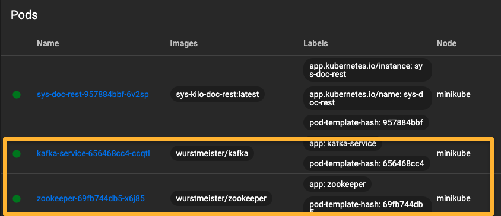
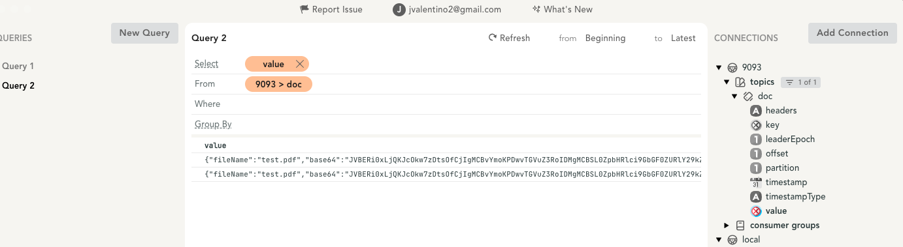

# Sys Kilo Eventing

This project represents the Kafka and Zookeeper containers as run on Kubernetes, as a part of the overall https://github.com/jvalentino/sys-kilo project. Kafka is the core of the system, and acts as the source of truth for all information. For system details, please see that location.

Prerequisites

- Git
- Helm
- Minikube
- kcat
- Kafka IDE
- Docker
- Kafka

All of these you can get in one command using this installation automation (if you are on a Mac): https://github.com/jvalentino/setup-automation

## Stack

### Kafka

> Apache Kafka is an open-source stream-processing software platform developed by the Apache Software Foundation, written in Scala and Java. The project aims to provide a unified, highthroughput, low-latency platform for handling real-time data feeds. Its storage layer is essentially a "massively scalable pub/sub message queue designed as a distributed transaction log," making it highly valuable for enterprise infrastructures to process streaming data. Additionally, Kafka connects to external systems (for data import/export) via Kafka Connect and provides Kafka Streams, a Java stream processing library.

https://en.wikipedia.org/wiki/Apache_Kafka

### ZooKeeper

> Apache ZooKeeper is a software project of the Apache Software Foundation. It is essentially a centralized service for distributed systems to a hierarchical key-value store, which is used to provide a distributed configuration service, synchronization service, and naming registry for large distributed systems. ZooKeeper was a sub-project of Hadoop but is now a top-level Apache project in its own right.

https://en.wikipedia.org/wiki/Apache_ZooKeeper

## Deployment

Prerequisites

- Minikube is running
- Minikube Dashboard is running

To deploy Kafka with Zookeeper, handle port-forwarding, and create the initial topic, use:

```bash
./deploy.sh
```

### kafka.yaml

```yaml
apiVersion: v1
kind: Service
metadata:
  labels:
    app: kafka-service
  name: kafka-service
spec:
  ports:
    - name: kafka-port
      port: 9092
      protocol: TCP
      targetPort: 9092
    - name: kafka-port-ext
      port: 9093
      protocol: TCP
      targetPort: 9093
  selector:
    app: kafka-service
  clusterIP: None
  type: ClusterIP
---
apiVersion: apps/v1
kind: Deployment
metadata:
  labels:
    app: kafka-service
  name: kafka-service
spec:
  replicas: 1
  selector:
    matchLabels:
      app: kafka-service
  template:
    metadata:
      labels:
        app: kafka-service
    spec:
      containers:
        - env:
            - name: KAFKA_BROKER_ID
              value: "1"
            - name: KAFKA_ZOOKEEPER_CONNECT
              value: zookeeper-service:2181
            - name: KAFKA_LISTENERS
              value: LISTENER_INTERNAL://kafka-service:9092,LISTENER_EXTERNAL://localhost:9093,LISTENER_EXTERNAL_2://kafka-service:9094
            - name: KAFKA_ADVERTISED_LISTENERS
              value: LISTENER_INTERNAL://kafka-service:9092,LISTENER_EXTERNAL://localhost:9093,LISTENER_EXTERNAL_2://kafka-service:9094
            - name: KAFKA_LISTENER_SECURITY_PROTOCOL_MAP
              value: LISTENER_INTERNAL:PLAINTEXT,LISTENER_EXTERNAL:PLAINTEXT,LISTENER_EXTERNAL_2:PLAINTEXT
            - name: KAFKA_INTER_BROKER_LISTENER_NAME
              value: LISTENER_INTERNAL
          image: wurstmeister/kafka
          imagePullPolicy: IfNotPresent
          name: kafka-service
          ports:
            - containerPort: 9092
            - containerPort: 9093
```

While normally I would use Helm, specifically `kafka https://charts.bitnami.com/bitnami`, I could not for the life of me get that Kafka variant to do what I need, specifically:

- Allowing a Kafka to communicate via localhost, so that I can create topics and tell if it is up from the command-line
- Allowing Kafka to communicate via its Kubenetes host name, `kafka-service`, internally for the running applications

Getting those use case to work required running on three different ports:

- LISTENER_INTERNAL on 9092 for internal broker communication
- LISTENER_EXTERNAL on 9093, which is the means for allowing localhost to be used when the port is forwarded
- LISTENER_EXTERNAL_2 on 9094, which is what the internal application use with the hostname of `Kafka-service` inside the cluster.

### zookeeper.yaml

```yaml
apiVersion: v1
kind: Service
metadata:
  labels:
    app: zookeeper-service
  name: zookeeper-service
spec:
  type: NodePort
  ports:
    - name: zookeeper-port
      port: 2181
      nodePort: 30181
      targetPort: 2181
  selector:
    app: zookeeper
---
apiVersion: apps/v1
kind: Deployment
metadata:
  labels:
    app: zookeeper
  name: zookeeper
spec:
  replicas: 1
  selector:
    matchLabels:
      app: zookeeper
  template:
    metadata:
      labels:
        app: zookeeper
    spec:
      containers:
        - image: wurstmeister/zookeeper
          imagePullPolicy: IfNotPresent
          name: zookeeper
          ports:
            - containerPort: 2181
```

Standard configuration, with nothing special.

### deploy.sh

```bash
#!/bin/sh
kubectl delete -f config/kompose/zookeeper.yaml,config/kompose/kafka.yaml
kubectl apply -f config/kompose/zookeeper.yaml,config/kompose/kafka.yaml

sh -x ./verify.sh
```

This is just using `kubectl` to delete and then deploy Kafka and Zookeeper using their YAML configurations.

It then executes a script to handle Kafka port forwarding, which also makes sure that it is running to create topics.

### verify.sh

```bash
#!/bin/sh
PORT=9093
NAME=kafka-service

mkdir build || true

kubectl port-forward --namespace default svc/$NAME $PORT:$PORT > build/$NAME.log 2>&1 &
kcat -b localhost:9093 -L

while [ $? -ne 0 ]; do
    kubectl port-forward --namespace default svc/$NAME $PORT:$PORT > build/$NAME.log 2>&1 &
    kcat -b localhost:9093 -L
    sleep 5
done

./create-topics.sh
```

This is a script that forwards the `Kafka-service` on Kubernetes to port 9093, its external location, and then checks to make sure it is running by using `kcat`. It then calls the script to create its topic if it doesn't already exist:

### create-topics.sh

```bash
#!/bin/sh
kafka-topics --bootstrap-server 127.0.0.1:9093 \
  --create \
  --topic doc \
  --partitions 10 \
  --if-not-exists
```

Creates the `doc` topic with 10 partitions if it does not already exist, using the external broker on port 9093.

### create-event.sh

```bash
#!/bin/sh
kafka-console-producer \
  --broker-list localhost:9093 \
  --topic doc \
  --property "parse.key=true" \
  --property "key.separator=:" < event.txt
```

The purpose of this script is to create a test event, which represents the creation of a document within the system. It works by pulling the JSON of that event out of the file `event.txt`.

## Runtime

### Kubernetes Dashboard



### Kafka IDE



If you use the `create-event.sh` script, you can see the event you created by creating on a connection on localhost:9093.


